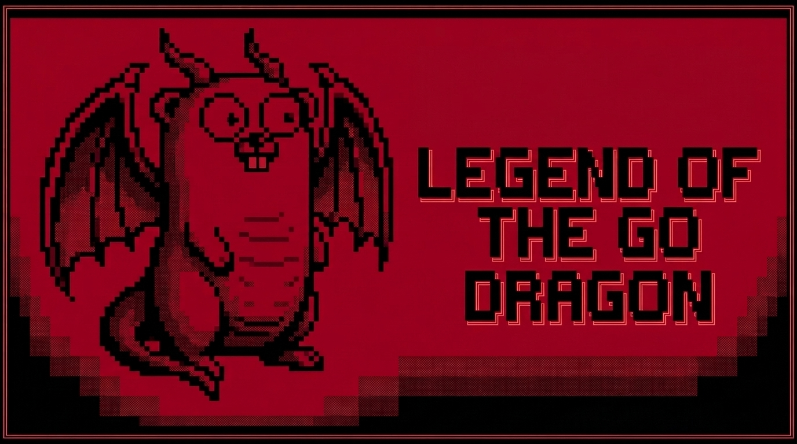

# 🐉 The Legend of the Go Dragon (LOTGD)

<p align="center">
  
</p>

<p align="center">
  <a href="CHANGELOG.md"></a>
  <a href="LICENSE"></a>
  <a href="https://goreportcard.com/report/github.com/cmellojr/lotgd"></a>
</p>

RPG em modo texto retrô (BBS / Roguelike) construído em **Go** com **Bubble Tea**, **Lip Gloss**, **SQLite** (CGO-free) e suporte a servidor **SSH multi-usuário** via **Wish**.

---

## 🚀 Início Rápido

### Requisitos
- **Go 1.22+**
- Terminal com suporte a cores ANSI
- Cliente `ssh` (para conexões ao servidor BBS)

### 🎮 Executar Offline (CLI Single-player)
```bash
go run ./cmd/lotgd
```
> **Dica:** É possível especificar um banco customizado com `-db=meu_save.db`.

### 🌐 Executar e Conectar ao Servidor SSH (BBS Multi-usuário)
```bash
# Iniciar o servidor
go run ./cmd/server

# Conectar via SSH (em outro terminal)
ssh localhost -p 2222
```

---

## 🕹️ Controles Principais

- **Navegação:** Setas `[↑ / ↓]` + `[Enter]` ou teclas vi (`k` / `j`).
- **Atalhos do Vilarejo:**
  - `[F]` Floresta Sombria
  - `[T]` Taverna
  - `[C]` Capela
  - `[M]` Ferraria
  - `[G]` Guilda
  - `[D]` Covil do Dragão
  - `[S]` Status
- **Combate:** `[A]` Atacar | `[P]` Usar Poção | `[F]` Fugir

---

## 🗺️ Estrutura do Projeto

```text
cmd/
├── lotgd/                 # Executável CLI offline
└── server/                # Servidor SSH BBS
docs/                      # Documentação de Design, Arquitetura e Lore
internal/
├── bestiary/              # Gerador de monstros e Dragão do Dia
├── engine/                # Regras de jogo, combate por turnos e progressão
├── i18n/                  # Dicionário de localização (PT-BR)
├── storage/               # Persistência SQLite CGO-free (modernc.org/sqlite)
├── tui/                   # Interface TUI e telas em Bubble Tea
└── ui/                    # Design System ANSI em Lip Gloss
```

---

## 📚 Documentação & Contribuição

- **[Game Design Document (GDD)](docs/GDD.md)**: Regras de jogo, fórmulas e balanceamento.
- **[Arquitetura & Engenharia](docs/architecture.md)**: Visão técnica das camadas e concorrência.
- **[Universo e Lore](docs/universo-e-prompt.md)**: Nomenclatura canônica, NPCs e tom narrativo.
- **[Guia de Agentes de IA](AGENTS.md)**: Diretrizes e convenções para agentes de IA.
- **[Guia de Contribuição](CONTRIBUTING.md)**: Workflow Git, estilo de código e testes.
- **[Changelog](CHANGELOG.md)**: Histórico de lançamentos e alterações.

---

## 🧪 Testes

```bash
go test ./... -v
go vet ./...
```

---

## 📄 Licença

Distribuído sob a licença [GPL-3.0](LICENSE).
