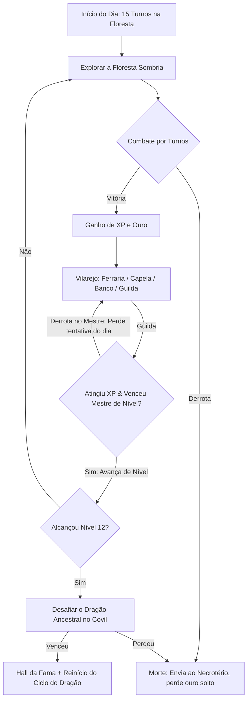

# Game Design Document (GDD) — The Legend of the Go Dragon

> **Documento Vivo de Design de Jogo**  
> **Gênero:** RPG em Modo Texto / BBS Door Game / TUI Multi-usuário  
> **Plataforma:** Terminal CLI / Servidor SSH (Go + Bubble Tea + Lip Gloss + Wish + SQLite)  
> **Referência Narrativa:** [universo-e-lore.md](universo-e-lore.md)
> **Decisões Arquiteturais:** [ADR-0006: Modelo de Balanceamento Econômico e Progressão por Combate com Mestres](../design/adr/0006-economic-balancing-and-master-combat-progression.md)

---

## 1. Visão Geral & Core Loop

### 1.1 Premissa & Elevator Pitch
Um vilarejo isolado vive sob a sombra de um Dragão que desperta a cada amanhecer ("o Novo Dia"). Jogadores conectam via terminal/SSH, exploram a Floresta Sombria, aprimoram seus heróis na Ferraria, desafiam seus Mestres na Guilda (*Turgon's Warrior Training*), interagem na Taverna e disputam quem será o herói a derrotar o Dragão no Nível 12 antes que o ciclo diário recomece.

### 1.2 Core Gameplay Loop

---

## 2. Mecânicas de Jogo & Balanceamento

### 2.1 Economia de Recursos
- **Turnos Diários (*Forest Fights*)**: 15 lutas/dia por jogador (renovadas no "Novo Dia").
- **Pontos de Vida (*HP*)**: Recuperados na Capela (Frei Anselmo) mediante oferenda ou descanso na Pousada.
- **Ouro (*Gold*)**: Reservado para compra de equipamentos (armas e armaduras na Ferraria), poções, cura na Capela e depósitos de segurança no Banco. Totalmente desvinculado do avanço de nível.
- **Experiência (*XP*)**: Acumulada em combates na floresta. Ao atingir o limiar exigido, destrava o direito de desafiar o Mestre de Nível correspondente na Guilda.

### 2.2 Sistema de Combate por Turnos
- **Fórmula de Dano**:
  $$\text{Dano} = \max(1, (\text{ATK}_{\text{atacante}} + \text{Rnd}(1, 4)) - \text{DEF}_{\text{defensor}})$$
- **Acerto Crítico**:
  - Há **10% de chance** em cada ataque de rolar um **Acerto Crítico**. Quando ocorre, o valor do ataque efetivo ($\text{ATK}_{\text{atacante}} + \text{Rnd}(1, 4)$) é multiplicado por **1,5** (+50% de dano base) antes de subtrair a defesa do oponente.
- **Ações no Turno**:
  - `[A]tacar`: Desfere golpe corpo a corpo aplicando a fórmula de dano e rolagem de crítico.
  - `[F]ugir`: Tenta recuar estrategicamente do combate.
    - **Chance base de sucesso**: 50%.
    - **Monstros com afixo "Covarde"**: 80% de chance de sucesso.
    - **Chefe Dragão do Dia**: 20% de chance de sucesso.
    - **Penalidade por falha**: Se a tentativa de fuga falhar, o inimigo recebe um contra-ataque livre de oportunidade.
  - `[P]oção`: Usa consumível (*Poção de Vida*) restaurando até +30 HP sem gastar o turno livre.

### 2.3 Guilda & Treinamento de Guerreiros (*Turgon's Warrior Training*)
A progressão do herói do Nível 1 ao Nível 12 ocorre através de desafios de combate na Guilda (*Turgon's Warrior Training*), alinhados com o clássico LORD (1989):
- **12 Níveis de Maestria**: O jogo conta com 12 níveis e 12 Mestres de Treinamento. O Nível 12 é o topo do jogo (Mestre Turgon).
- **Acesso ao Covil do Dragão**: Apenas heróis que alcançaram o **Nível 12** e venceram o Mestre Turgon estão qualificados para entrar no Covil e desafiar o Dragão Ancestral.
- **Regras do Desafio ao Mestre**:
  - Exige o limiar de XP acumulado para o nível alvo.
  - Limite de **1 tentativa por dia por Mestre**.
  - **Derrota sem Pena de Morte**: Caso perca a luta para o Mestre, o jogador não morre e não perde HP; apenas consome a tentativa diária e deve retornar no dia seguinte.

---

## 3. Estrutura de Telas & Mapeamento TUI (Bubble Tea)

| Tela | Rota TUI | Comandos / Atalhos Principais |
|---|---|---|
| **Login / Criação** | `ScreenLogin` | Digitar nome/senha, `[Enter]` confirma, `[Tab]` alterna |
| **Praça do Vilarejo** | `ScreenTown` | `[F]` Floresta, `[T]` Taverna, `[C]` Capela, `[M]` Ferraria, `[G]` Guilda, `[D]` Dragão, `[S]` Status, `[Q]` Sair |
| **Floresta Sombria** | `ScreenForest` | `[P]` Procurar monstro, `[A]` Atacar, `[F]` Fugir, `[V]` Voltar à vila |
| **Ferraria (Torin)** | `ScreenSmith` | `[1..12]` Comprar Armas, `[1..12]` Comprar Armaduras |
| **Capela (Anselmo)** | `ScreenChapel` | `[C]` Curar ferimentos, `[B]` Pedir bênção |
| **Taverna (Rosalinda)**| `ScreenTavern` | `[O]` Ouvir fofocas, `[F]` Flertar com Cassandra |
| **Guilda (Turgon)** | `ScreenGuild` | `[D]` Desafiar Mestre de Nível (*Turgon's Warrior Training*) |
| **Covil do Dragão** | `ScreenDragon` | `[D]` Desafiar o Dragão do Dia (Requer Nível 12) |

---

## 4. Arquitetura e Engenharia em Go

- **`internal/engine`**: Lógica pura de regras, structs de domínio em inglês (`Player`, `CombatEngine`, `Stats`, `MasterCatalog`).
- **`internal/bestiary`**: Tiers de monstros (1 a 4) com gerador procedural de prefixos (*"Feroz"*, *"Covarde"*, etc.).
- **`internal/i18n`**: Dicionários `pt_br.go` isolando textos da interface.
- **`internal/storage`**: SQLite puro (`modernc.org/sqlite`) para multi-usuário com persistência em disco.
- **`cmd/lotgd` & `cmd/server`**: Suporte unificado tanto para cliente local quanto servidor SSH via Wish.
